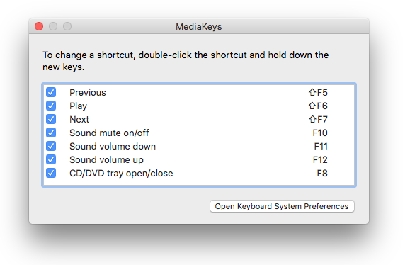

MediaKeys
====================

I use a keyboard that lacks any multimedia media keys (volume up, volume down, mute, eject).  
Since macOS doesn't allow you to remap existing keys as media keys I wrote MediaKeys to allow you to do just that.  
You must leave the app running in the background for the remapping to occur.

Go to MediaKeys -> Preferences to configure the key mappings.

Acknowledgements
---------------------

MediaKeys uses ShortcutRecorder.
https://github.com/shortcutrecorder/shortcutrecorder
Copyright 2006-2007 Contributors. All rights reserved.
Contributors: David Dauer, Jesper, Jamie Kirkpatrick, Andy Kim
